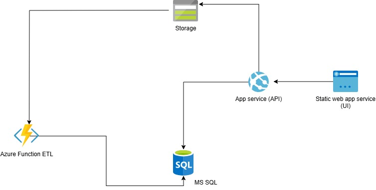

# Sustainability Reporting Platform

A full-stack solution for sustainability data collection, aggregation, and reporting.  
This project includes:
- **Blazor WebAssembly UI** for user interaction and CSV upload
- **ASP.NET Core Web API** for data access and aggregation
- **Azure Functions ETL** for ingesting and processing CSV data
- **Shared DTOs and DataContext** for model consistency

---

## Setup & Run Instructions

### Prerequisites
- [.NET 9 SDK](https://dotnet.microsoft.com/download/dotnet/9.0)
- [Azure Storage Account](https://portal.azure.com/) (for blob storage)
- [Azure Functions Core Tools](https://learn.microsoft.com/en-us/azure/azure-functions/functions-run-local) (for local ETL testing)
- [Visual Studio 2022](https://visualstudio.microsoft.com/vs/)
- [SQL Server](https://www.microsoft.com/en-us/sql-server/sql-server-downloads) (local or Azure)
  

### 1. Database Setup
- Update the connection string in `SustainabilityReportingAPI/appsettings.Development.json` and `appsettings.json` to point to your SQL Server.
- Run EF Core migrations to create the database

### 2. Azure Blob Storage
- Set your Azure Blob Storage connection string in `appsettings.Development.json` and `local.settings.json` for the ETL project.
- Ensure the container (e.g., `sustainabilitydata`) exists.

### 3. Running the API
The API will be available at `https://localhost:7155/` (or as configured).

### 4. Running the Blazor UI
The UI will be available at `https://localhost:PORT/`.

### 5. Running the ETL Function
- Use the Azure Functions Core Tools or deploy to Azure Functions.
- Local run:

  
---

## Assumptions

- **Authentication**: The UI uses a mock authentication service for local development. In production, Entra ID (Azure AD) will be used.
- **Blob Storage**: All CSV uploads are stored in Azure Blob Storage and processed by the ETL function.
- **Data Model**: DTOs and EF models are kept in shared projects for consistency.
- **API Security**: In development, CORS and security are relaxed; in production, they should be restricted.
- **File Size**: CSV upload is limited to 10MB by default in the UI.

---

## Productionization Notes

### Azure Blob Storage
- Use Azure Blob storage for all file uploads.
- Secure access with SAS tokens or managed identities.
- Store connection strings/secrets in Azure Key Vault.

### Azure SQL Database
- Use for scalable, managed relational storage.
- Enable automated backups.

### Authentication (Entra ID)
- Integrate for secure, enterprise-grade authentication.
- Use MSAL libraries in Blazor for authentication and token acquisition.
- Secure API endpoints with `[Authorize]` and validate tokens.

### CI/CD with GitHub Actions or Azure service publish profiles
- Add `.github/workflows/` with pipelines for:
- Build, test, and lint on PRs
- Deploy to Azure (Web App, Functions, SQL, etc.)
- Download avalable publish profiles on azure and manualy publish the project

## Additional Recommendations

- **Monitoring**: Use Azure Monitor for logging and monitoring.
- **Secrets Management**: Use Azure Key Vault for all secrets and connection strings.
- **Documentation**: Add Swagger/OpenAPI (already included via Swashbuckle) for API docs.

## Solution Diagram

